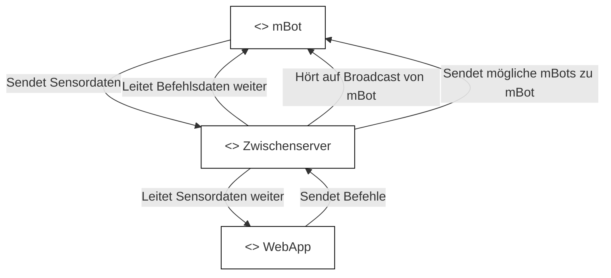
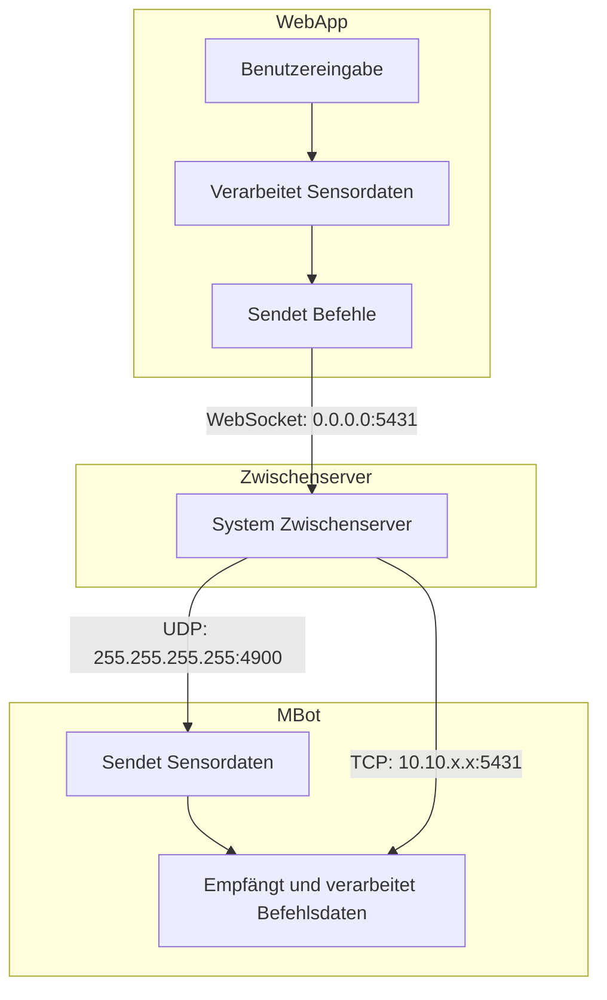

| **Projektbezeichnung** | MBot-Controller                                 |
|-------------------------|------------------------------------------------|
| **Projektteam**         | Tobias Haas, Patrick Thor, Stefan Rautner      |
| **Erstellt am**         | 27.05.2024                                     |
| **Letzte Änderung am**  | 08.06.2024                                     |
| **Status**              | Fertig                                         |
| **Aktuelle Version**    | 1.4                                            |

 

# Änderungsverlauf

| Nr. | Datum      | Version | Geänderte Kapitel  | Art der Änderung | Autor          |
|-----|------------|---------|--------------------|------------------|----------------|
| 1   | 27.05.2024 | 1.0     | Alle               | Erstellung       | Stefan Rautner |
| 2   | 28.05.2024 | 1.1     | 5.1, 5.2           | Ergänzung        | Stefan Rautner |
| 3   | 05.06.2024 | 1.2     | 5                  | Ergänzung        | Stefan Rautner |
| 4   | 07.06.2024 | 1.3     | 1, 2, 3, 4, 5      | Ergänzung        | Stefan Rautner |
| 5   | 08.06.2024 | 1.4     | 5, 6, 7, 8         | Ergänzung        | Stefan Rautner |

# Inhalt

1. [Allgemeines / Projektübersicht](#1-allgemeines--projektübersicht) 
   1.1 [Projektbeschreibung](#11-projektbeschreibung) 
   1.2 [Projektteam und Schnittstellen](#12-projektteam-und-schnittstellen)

2. [Funktionale Anforderungen](#2-funktionale-anforderungen) 
   2.1 [Use Cases](#21-use-cases) 
   2.1.1 [Download Webapp](#211-download-webapp) 
   2.1.2 [Download MBot-Script](#212-download-mbot-script) 
   2.1.3 [Download & Start Zwischenserver](#213-download--start-zwischenserver) 
   2.1.4 [Steuerung des MBot](#214-steuerung-des-mbot) 
   2.1.5 [LineFollower](#215-linefollower) 
   2.1.6 [SuicidePrevention](#216-suicideprevention) 
   2.1.7 [Ambientebeleuchtung](#217-ambientebeleuchtung) 
   2.1.8 [DinoGame](#218-dinogame)

3. [Nichtfunktionale Anforderungen](#3-nichtfunktionale-anforderungen)

4. [Projektplanung](#4-projektplanung) 
   4.1 [Variantenbildung](#41-variantenbildung) 
   4.2 [Machbarkeitsstudie](#42-machbarkeitsstudie) 
   4.3 [Allgemeine Planungsinformationen](#43-allgemeine-planungsinformationen) 
   4.4 [Projektumfeldanalyse](#44-projektumfeldanalyse)

5. [Softwarearchitektur](#5-softwarearchitektur) 
   5.1 [Aktivitätsdiagramme](#51-aktivitätsdiagramme) 
   5.1.1 [MBot suchen & verbinden](#511-mbot-suchen--verbinden) 
   5.1.2 [Daten an den MBot senden & Sensordaten vom MBot erhalten](#512-daten-an-den-mbot-senden--sensordaten-vom-mbot-erhalten) 
   5.1.3 [Von dem MBot trennen](#513-von-dem-mbot-trennen) 
   5.1.4 [Webapp schließen](#514-webapp-schließen) 
   5.2 [Sequenzdiagramme](#52-sequenzdiagramme) 
   5.2.1 [Sequenzdiagramm MBot verbinden](#521-sequenzdiagramm-mbot-verbinden) 
   5.2.2 [Sequenzdiagramm Daten senden](#522-sequenzdiagramm-daten-senden) 
   5.2.3 [Sequenzdiagramm Disconnect](#523-sequenzdiagramm-disconnect) 
   5.2.4 [Sequenzdiagramm Close](#524-sequenzdiagramm-close) 
   5.3 [Komponentendiagramme](#53-komponentendiagramme) 
   5.4 [Verteilungsdiagramme](#54-verteilungsdiagramme) 
   5.5 [Softwarekomponenten / Programme](#55-softwarekomponenten--programme) 
   5.5.1 [SW Programme](#551-sw-programme) 
   5.5.2 [SW Komponenten](#552-sw-komponenten)

6. [Projektdurchführung](#6-projektdurchführung) 
   6.1 [Sprint 1](#61-sprint-1) 
   6.1.1 [Sprintplanung](#611-sprintplanung) 
   6.1.2 [Sprint Demo](#612-sprint-demo) 
   6.1.3 [Sprint Retrospektive](#613-sprint-retrospektive) 
   6.1.4 [Sprint Zusammenfassung](#614-sprint-zusammenfassung) 
   6.2 [Sprint 2](#62-sprint-2) 
   6.2.1 [Sprintplanung](#621-sprintplanung) 
   6.2.2 [Sprint Demo](#622-sprint-demo) 
   6.2.3 [Sprint Retrospektive](#623-sprint-retrospektive) 
   6.2.4 [Sprint Zusammenfassung](#624-sprint-zusammenfassung) 
   6.3 [Sprint 3](#63-sprint-3) 
   6.3.1 [Sprintplanung](#631-sprintplanung) 
   6.3.2 [Sprint Demo](#632-sprint-demo) 
   6.3.3 [Sprint Retrospektive](#633-sprint-retrospektive) 
   6.3.4 [Sprint Zusammenfassung](#634-sprint-zusammenfassung) 
   6.4 [Sprint 4](#64-sprint-4) 
   6.4.1 [Sprintplanung](#641-sprintplanung) 
   6.4.2 [Sprint Demo](#642-sprint-demo) 
   6.4.3 [Sprint Retrospektive](#643-sprint-retrospektive) 
   6.4.4 [Sprint Zusammenfassung](#644-sprint-zusammenfassung) 
   6.5 [Sprint 5](#65-sprint-5) 
   6.5.1 [Sprintplanung](#651-sprintplanung) 
   6.5.2 [Sprint Demo](#652-sprint-demo) 
   6.5.3 [Sprint Retrospektive](#653-sprint-retrospektive) 
   6.5.4 [Sprint Zusammenfassung](#654-sprint-zusammenfassung)

7. [Installation / Software deployment](#7-installation--software-deployment)

8. [Projektabschluss](#8-projektabschluss) 
   8.1 [Projektzusammenfassung](#81-projektzusammenfassung) 
   8.2 [Attachments](#82-attachments)

# 1. Allgemeines / Projektübersicht
## 1.1 Projektbeschreibung
Das Projekt zielt darauf ab, eine Anwendung zur Fernsteuerung eines MBot2s zu entwickeln, die sowohl auf Computern als auch auf mobilen Geräten (Handys, Tablets, …) funktioniert. Der MBot2 ist mit diversen Sensoren und Aktoren ausgestattet und wird über MicroPython programmiert. Die Anwendung ermöglicht die automatische Netzwerkverbindung, zeigt Sensordaten an und erlaubt das Verarbeiten von Steuerbefehlen wie Bewegungsrichtung und Geschwindigkeit. Ein Sicherheitsmodus verhindert Kollisionen und einen Linienfolgemodus zum automatischen Folgen einer Linie. Das Projekt wird dem agilen Projektmanagement SCRUM durchgeführt. Die Projektlaufzeit ist vom 10. Januar 2024 bis zum 12. Juni 2024.

## 1.2 Projektteam und Schnittstellen
| Rolle(n)           | Name             | Telefon | E-Mail                              | Team    |
|--------------------|------------------|---------|-------------------------------------|---------|
| Frontend Developer | Tobias Haas      | Privat  | Tobias.haas@htl-saalfelden.at       | Group05 |
| 3D-Designer        | Patrick Thor     | Privat  | Patrick.thor@htl-saalfelden.at      | Group05 |
| Backend Developer  | Stefan Rautner   | Privat  | Stefan.rautner@htl-saalfelden.at    | Group05 |

# 2. Funktionale Anforderungen
## 2.1 Use Cases
### 2.1.1 Download Webapp
 
- Akteur: Benutzer 
- Vorbedingung: Benutzer muss funktionierenden Internetzugang und Zugang zur Webapp haben 
- Beschreibung: Der Benutzer drückt auf den „Download“-Button auf der Webapp (Home-Screen, relativ weit unten) und der Download startet automatisch, nachdem dieser Abgeschlossen ist, muss der User in dem erscheinenden Dialog (rechts oben am Bildschirm) auf „Installieren“ klicken um die Webapp zu Installieren. 
- Ergebnis: Die Webapp ist wie eine native App auf dem Gerät des Users installiert und kann ohne Internetzugriff verwendet werden (für die Steuerung des MBot muss aber trotzdem eine Internetverbindung hergestellt werden).

### 2.1.2 Download MBot-Script
 
- Akteur: Benutzer 
- Vorbedingung: Benutzer muss funktionierenden Internetzugang und Zugang zur Webapp haben. 
- Beschreibung: Der Benutzer drückt in dem Text auf das markierte „HIER (Home-Screen, ganz unten), danach startet der Download automatisch. 
- Ergebnis: Das MBot-Skript ist heruntergeladen und kann jetzt vom Benutzer weiter entwickelt/verwendet werden.

### 2.1.3 Download & Start Zwischenserver
 
- Akteur: Benutzer 
- Vorbedingung: Benutzer muss funktionierenden Internetzugang und Zugang zur Webapp haben. 
- Beschreibung: Der Benutzer öffnet den Tab „Controller“ in der Navigationsleiste der Webapp, dadurch wird der Zwischenserver (falls das aufrufende Gerät ein PC ist, wenn nicht, dann erscheint ein Dialog) automatisch heruntergeladen. Der Zwischenserver muss danach vom Benutzer manuell ausgeführt werden. Der Zwischenserver lädt sich automatisch die benötigten Module herunter und installiert diese, sodass der Zwischenserver funktionsfähig ist. 
- Ergebnis: Der Zwischenserver ist gestartet und wartet auf Befehle von Webapp und MBot.

### 2.1.4 Steuerung des MBot
 
- Akteur: Benutzer 
- Vorbedingung: Benutzer muss funktionierenden Internetzugang und Zugang zur Webapp haben, außerdem muss Python installiert sein. 
- Beschreibung: Der Benutzer öffnet den Tab „Controller“ in der Navigationsleiste, danach muss der heruntergeladene Zwischenserver gestartet werden und die Checkbox „Zwischenserver gestartet“ angekreuzt werden. Jetzt muss der gewünschte MBot ausgewählt werden, danach kann man diesen Steuern. 
- Ergebnis: Der Benutzer kann den MBot mit Hilfe des Zwischenservers über die Webapp steuern.

### 2.1.5 LineFollower
 
- Akteur: Benutzer 
- Vorbedingung: Benutzer muss funktionierenden Internetzugang und Zugang zur Webapp haben und mit einem MBot verbunden sein. 
- Beschreibung: Der Benutzer kreuzt die Checkbox „LineFollower“ an, dadurch wird von dem System die Steuerung übernommen. 
- Ergebnis: Der Benutzer hat die Funktione LineFollower auf dem MBot gestartet.

### 2.1.6 SuicidePrevention
 
- Akteur: Benutzer 
- Vorbedingung: Benutzer muss funktionierenden Internetzugang und Zugang zur Webapp haben und mit einem MBot verbunden sein. 
- Beschreibung: Der Benutzer kreuzt die Checkbox „SuicidePrevention“ an, dadurch stoppt der MBot automatisch vor Hindernissen. 
- Ergebnis: Der Benutzer hat die SuicidePrevention auf dem MBot gestartet.

### 2.1.7 Ambientebeleuchtung
 
- Akteur: Benutzer 
- Vorbedingung: Benutzer muss funktionierenden Internetzugang und Zugang zur Webapp haben und mit einem MBot verbunden sein. 
- Beschreibung: Der Benutzer kreuzt wählt in den 5 ColorPickern (unten bei Steuerungen Mitte) die jeweils gewünschte Farbe aus. 
- Ergebnis: Wenn der MBot stillsteht, ändern sich die Farben der 5 LEDs automatisch nach den Benutzereingaben.

### 2.1.8 DinoGame
 
- Akteur: Benutzer 
- Vorbedingung: Benutzer muss funktionierenden Internetzugang und Zugang zur Webapp haben. 
- Beschreibung: Der Benutzer öffnet in der Navigationsleiste den Tab „Dino-Game“ und kann dort eine abgespeckte Version des originalen Dino-Games von Google spielen. 
- Ergebnis: Der Benutzer kann das Dino-Game spielen.

# 3. Nichtfunktionale Anforderungen
Benutzer benötigt einen PC 
Benutzer benötigt einen Browser 
Benutzer benötigt eine funktionierende Internetverbindung

Verwendetes Betriebssystem: Windows 11 64-bit 
Verwendete IDEs: PyCharm Version 2024.1.1 & Mblock Version 5.4.3

# 4. Projektplanung
Webapp in den Sprachen HTML, CSS & JS 
Zwischenserver in der Sprache Python 
MBot in der Sprache Micropython 
Unterstützung für alle Geräte & Betriebssysteme (benötigt aber PC für Zwischenserver)

## 4.1 Variantenbildung
Mit einem Zwischenserver in Spring-Boot (verworfen, weil größeres Framework). 
In einem Docker-Container (verworfen, schwerer zu bedienen). 
Mit einem Zwischenserver in Python (ausgeführt, benötigt nur Python, installiert Module automatisch, sehr benutzerfreundlich). 
Ohne Zwischenserver durch WebSocket (verworfen, MBot keine WebSocket Unterstützung) 
Ohne Zwischenserver durch UDP (verworfen, UDP im Web nicht möglich) 
Ohne Zwischenserver durch TCP (verworfen, TCP im Web nicht möglich)

## 4.2 Machbarkeitsstudie
Zwischenserver in Python (Unterstützung für WebSockets und UDP & TCP im lokalen Netzwerk) 
MBot mit UDP & TCP Sockets verbinden (UDP wegen Broadcast, TCP weil sicherer)

## 4.3 Allgemeine Planungsinformationen
Aufteilung: 
Tobias Haas: grafische Oberfläche & Dino-Game 
Patrick Thor: 3D-Model erstellen & anzeigen 
Stefan Rautner: Programmierung, GitHub & Dokumentation

## 4.4 Projektumfeldanalyse
Es gibt schon vergleichbare Produkte auf dem Markt (in Form einer Fernsteuerung für einen Roboter) aber noch nicht für den MBot2. Es wird aber in nächster Zukunft mehrere geben, da die anderen Gruppen in unserer Klasse den gleichen Projektauftrag erhalten haben. Die Stakeholder des Projekts sind unsere Professoren Herr Falkensteiner & Herr Eigner.

# 5. Softwarearchitektur
Komponenten: Webapp, Zwischenserver & MBot 
Verteiltes System, das auf einem Gerät die von GitHub-Pages gehostete Webapp besucht, auf dem gleichen oder anderen PC muss der Zwischenserver gehostet werden (wird von der Webapp auto gedownloaded), wenn die Steuerung über ein Mobilgerät erfolgt, dann Zwischenserver auf PC und Webapp-Aufruf auf Mobilgerät und MBot Skript local auf dem MBot. 
Die Webapp und der MBot kommunizieren über den Zwischenserver miteinander. 
Der Zwischenserver erstellt einen UDP-Socket der nach der Broadcastnachricht des MBot sucht. 
Die Webapp gibt dem Zwischenserver den Befehl nach MBot-Broadcastnachrichten zu suchen. 
Wenn die Broadcastnachricht des MBot gefunden wurde, dann verbindet sich der Zwischenserver durch einen TCP-Socket mit dem MBot für durchgehende Kommunikation.

## 5.1 Aktivitätsdiagramme
### 5.1.1 MBot suchen & verbinden
Webapp sendet Befehl zum MBots suchen, Zwischenserver sucht über den UDP-Socket nach der Broadcastnachricht „MBot2-Group05_4AHINF“. Alle gefundenen MBots werden an die Webapp zurückgegeben, dort wählt der Benutzer einen MBot aus. Die Adresse des MBot wird automatisch an den Zwischenserver gesendet und dieser verbindet sich dadurch automatisch mit dem TCP-Socket des MBot. Dieser schließt danach den UDP-Socket.

### 5.1.2 Daten an den MBot senden & Sensordaten vom MBot erhalten
Webapp sendet Steuerbefehl an Zwischenserver, dieser leitet den Befehl an den MBot weiter. Dort werden die Daten verarbeitet (SuicidePrevention, Ambientebeleuchtung, …) und die Sensordaten ausgelesen. Die Sensordaten werden dann an den Zwischenserver gesendet, dieser Sendet die Daten dann an die Webapp weiter. Dort werden die Sensordaten verarbeitet und dem Benutzer angezeigt.

### 5.1.3 Von dem MBot Trennen
Die Webapp sendet den Disconnect Befehl an den Zwischenserver, dieser sendet darauf den „Disconnect“-Befehl an den MBot und schließt die Verbindung zum TCP-Socket. Der MBot „restartet“ dadurch sein Skript und bereitet sich für die nächste Verbindung vor.

### 5.1.4 Webapp schließen
Der Benutzer schließt die Webapp, dadurch sendet wird der „Close“-Befehl an den Zwischenserver gesendet. Der Zwischenserver sendet darauf den „Disconnect“-Befehl an den MBot und trennt den TCP-Socket & schließt den WebSocket. Der MBot „restartet“ dadurch sein Skript und bereitet sich für die nächste Verbindung vor.

## 5.2 Sequenzdiagramme
### 5.2.1 Sequenzdiagramm MBot Verbinden
Die Webapp sendet einen Search Befehl an den MBot, dieser sucht dann über einen UDP-Socket nach dem Broadcast „MBot2-Group05_4AHINF“ und gibt dann die gefundenen MBots zurück. Dort wird dann ein MBot ausgewählt und dessen Adresse an den Zwischenserver gesendet. Der Zwischenserver verbindet sich jetzt über diese Adresse mit dem TCP-Socket des MBot.

### 5.2.2 Sequenzdiagramm Daten Senden
Die WebApp verarbeitet Benutzerdaten und sendet diese dann an den Zwischenserver weiter, dieser sendet die Daten sofort über den TCP-Socket an den MBot weiter. Der MBot verarbeitet die erhaltenen Daten (stellt dadurch die Ambientebeleuchtung, SuicidePrevention, … ein), liest die Sensordaten aus und sendet diese dann zurück an den Zwischenserver. Der Zwischenserver sendet diese Daten dann über den WebSocket an die Webapp weiter. Dieser Kreislauf wiederholt sich automatisch unendlich, bis der Benutzer den MBot trennt oder die Webapp schließt.

### 5.2.3 Sequenzdiagramm Disconnect
Der Benutzer sendet den „Disconnect“-Befehl an den Zwischenserver, dieser sendet dann eine „Disconnect“-Nachricht an den MBot und schließt die TCP-Socket Verbindung zum MBot. Der MBot startet dann sein Skript neu.

### 5.2.4 Sequenzdiagramm Close
Der Benutzer sendet den „Close“-Befehl an den Zwischenserver, dieser sendet dann eine „disconnect“-Nachricht an den MBot und schließt die TCP-Socket Verbindung zum MBot und den WebSocket. Der MBot startet dann sein Skript neu.

## 5.3 Komponentendiagramme

 
## 5.4 Verteilungsdiagramme

## 5.5 Softwarekomponenten / Programme
### 5.5.1 SW Programme
PyCharm, Version: 2024.1.1 
MBlock, Version 5.4.3

### 5.5.2 SW Komponenten
Hyper Text Markup Language 
Version: HTML 5.2 
Hersteller: Sir Timothy John Berners-Lee, World Wide Web Consortium (W3C) & Web Hypertext Application Technology Working Group (WHATWG) 
Downloadlink: Kein Download möglich (nur in IDEs) 
[Lizenz](https://www.w3.org/2011/03/html-license-options.html) 

Cascading Style Sheets 
Version: CSS 3 
Hersteller: Hakon Wium Lie & World Wide Web Consortium (W3C) 
Downloadlink: Kein Download möglich (nur in IDEs) 
[Lizenz](https://www.w3.org/copyright/document-license-2023/)

Javascript (ofizieller Name: ECMA Script) 
Version: ECMAScript 2023 
Hersteller: Oracle 
Downloadlink: Kein Download möglich (nur in IDEs) 
[Lizenz](https://docs.oracle.com/cd/E19957-01/816-6152-10/copyrt.html)

Python 3.12 
Version: 3.12.3 
Hersteller: Python Software Foundation (Guido van Rossum) 
[Downloadlink](https://www.microsoft.com/store/productId/9NCVDN91XZQP?ocid=pdpshare) 
[Lizenz](https://docs.python.org/3/license.html) 

# 6. Projektdurchführung
## 6.1 Sprint 1
### 6.1.1 Sprintplanung
Dauer: 07.02.2024 – 28.02.2024 

Ausgewählte User Stories: 

Bearbeiter: Stefan Rautner 
ID: 6 
Name: Automatische Verbindung zum WLAN nachdem MBot eingeschalten wurde 

Bearbeiter: Stefan Rautner 
ID: 7 
Name: Steuerung des MBot vom Client über den Zwischenserver eingeschalten wurde

Bearbeiter: Stefan Rautner 
ID: 8 
Name: Verbindung der Webapp mit dem MBot über den Zwischenserver
eingeschalten wurde

Bearbeiter: Stefan Rautner 
ID: 9 
Name: Webapp automatisch mit Zwischenserver verbinden
eingeschalten wurde

Bearbeiter: Stefan Rautner 
ID: 10 
Name: Implementierung eines LineFollower für den MBot eingeschalten wurde

Bearbeiter: Stefan Rautner 
ID: 2 
Name: Implementierung einer SuicidePrevention für den MBot
wurde

Bearbeiter: Tobias Haas 
ID: 3 
Name: Webapp mit mobilen Geräten kompatible machen
eingeschalten wurde

Anzahl geplante Story points: 120 
Geschaffte Story points: 45

### 6.1.2 Sprint Demo
Die Eingabemethoden: WASD, Pfeil-Tasten, Touch & Controller sind implementiert worden und funktionieren. 
Die Verbindung vom MBot zum WLAN funktioniert. 
Implementierung der Steuerung des MBot wurde begonnen, aber nicht abgeschlossen. 
Implementierung der Verbindung des MBot wurde begonnen, aber nicht abgeschlossen. 
Die Webapp verbindet sich automatisch mit dem Zwischenserver. 
Der LineFollower wurde nicht implementiert. 
Implementierung der SuicidePrevention wurde begonnen, aber nicht abgeschlossen. 
Es wurde begonnen, eine Unterstützung der Webapp für mobile Geräte zu erstellen.

### 6.1.3 Sprint Retrospektive
Da es der Erste Sprint war, hatten wir noch keine Erfahrung, wie viel wir in einem Sprint machen können. 
Ich (Stefan Rautner) habe mich in diesem Sprint überschätzt und bin dadurch nur mit ca. 50% meiner Aufgaben fertig geworden. 
Das Abschließen der User Story von Tobias Haas ist rein technisch nicht möglich, weil die Grafische Oberfläche im Verlauf der zukünftigen Sprints immer wieder aktualisiert werden wird.

### 6.1.4 Sprint Zusammenfassung
Grundsätzlich ist der Sprint gut gelaufen, aber ich (Stefan Rautner) habe mich sehr übernommen. 
Es wurden keine neuen User Stories hinzugefügt. 
Es wurden ebenfalls keine User Stories entfernt.
 
Auf Basis dieser Sprint Velocity ist das Projekt früher als erwartet fertig. 
Die Durchschnittliche Sprint Velocity beträgt 45.

## 6.2 Sprint 2
### 6.2.1 Sprintplanung
Dauer: 29.02.2024 – 20.03.2024

Ausgewählt User Stories: 

Bearbeiter: Stefan Rautner 
ID: 11 
Name: MBot mit der Zeit immer schneller fahren lassen

Bearbeiter: Stefan Rautner 
ID: 12 
Name: Client zeigen, dass MBot mit WLAN verbunden ist

Bearbeiter: Patrick Thor & Stefan Rautner 
ID: 13 
Name: Ausrichtung des MBot durch 3D-Model mit dessen Gyrodaten auf dem Client anzeigen

Bearbeiter: Tobias Haas 
ID: 14 
Name: Grafische Oberfläche für die Webapp

Anzahl geplanter User Stories: 31 
Geschaffte Story Points: 21

### 6.2.2 Sprint Demo
Der MBot beschleunigt jetzt je länger eine Taste gedrückt wird oder je weiter der Stick des Controllers in eine Richtung gedrückt wird. 
Dem Client wird jetzt angezeigt, dass der MBot mit dem WLAN verbunden ist. 
Die Webapp beinhält jetzt ein 3D-Model welches abhängig von den Gyrodaten des MBot geupdatet wird. 
Die Grafische Oberfläche der Webapp wurde verbessert.

### 6.2.3 Sprint Retrospektive
In diesem Sprint war die Planung der User Stories deutlich besser. 
Die User Story von Tobias Haas konnte wie im Letzten Sprint bereits beschrieben nicht abgeschlossen werden, weil die Grafisch Oberfläche in folgenden Sprints sicher noch geändert wird.

### 6.2.4 Sprint Zusammenfassung
Diesmal ist der Sprint besser ausgefallen und wir haben fast alle Arbeitspakete erfolgreich erledigen können. 
Es wurde 2 neue Anforderungen hinzugefügt:
- Anzeigen der Farben unter den RGB-Sensoren des MBot während aktivem LineFollower.
- Die 3D-Anzeige des MBots aufgrund seiner Gyrodaten verändern.
Es wurden keine User Stories entfernt.
 
 
Auf Basis dieser Sprint Velocity ist das Projekt später als erwartet fertig. 
Die Durchschnittliche Sprint Velocity beträgt jetzt 33.

## 6.3 Sprint 3
### 6.3.1 Sprintplanung
Dauer: 21.03.2024 – 17.04.2024

Ausgewählt User Stories: 

Bearbeiter: Stefan Rautner 
ID: 23 
Name: Ausführung des Zwischenservers

Bearbeiter: Stefan Rautner 
ID: 4 
Name: Daten der 4 RGB-Sensoren bei aktiviertem LineFollower an den Client senden

Bearbeiter: Stefan Rautner 
ID: 5 
Name: Geschwindigkeit des MBot durch dessen Beschleunigungssensors an den Client senden

Bearbeiter: Tobias Haas 
ID: 14 
Name: Grafische Oberfläche für die Webapp

Anzahl geplanter User Stories: 41 
Geschaffte Story Points: 31

### 6.3.2 Sprint Demo
Der Zwischenserver ist jetzt ausführbereit und hat alle benötigten Funktionen für unseren Anwendungsfall. 
Die 4 RGB-Sensoren werden jetzt bei aktivem LineFollower ausgelesen und auf der Webapp angezeigt. 
Die Geschwindigkeit des MBot wird jetzt ausgelesen und auf der Webapp dargestellt. 
Die Grafische Oberfläche der Webapp wurde weiter verbessert.

### 6.3.3 Sprint Retrospektive
In diesem Sprint war die Planung der User Stories relativ gleich wie im Letzten. 
Die User Story von Tobias Haas ist wie in den letzten zwei Sprints beschrieben nicht abschließbar, weil die Grafisch Oberfläche in folgenden Sprints sicher noch geändert wird. 

### 6.3.4 Sprint Zusammenfassung
Diesmal ist der Sprint besser ausgefallen und wir haben fast alle Arbeitspakete erfolgreich erledigt. 
Es wurden keine weiteren User Stories hinzugefügt. 
Es wurden die User Stories „Firebase“ entfernt.
 
Auf Basis dieser Sprint Velocity wird das Projekt ca. zum Abgabezeitpunkt fertig. 
Die Durchschnittliche Sprint Velocity beträgt jetzt 32,33.

## 6.4 Sprint 4
### 6.4.1 Sprintplanung
Dauer: 18.04.2024 – 15.05.2024

Ausgewählt User Stories: 

Bearbeiter: Stefan Rautner 
ID: 20 
Name: Ambientebeleuchtung auf MBot durch Client einstellen & einschalten

Bearbeiter: Stefan Rautner 
ID: 21 
Name: Liniendiagramm mit den Daten der Beschleunigungssensors erstellen

Bearbeiter: Stefan Rautner 
ID: 22 
Name: Liniendiagramm mit den Daten des Ultraschallsensors erstellen

Bearbeiter: Tobias Haas 
ID: 24 
Name: Dino-Game implementieren, dass vom Client gespielt werden kann

Anzahl geplanter User Stories: 27 
Geschaffte Story Points: 27

### 6.4.2 Sprint Demo
Die Ambientebeleuchtung kann jetzt vom User ausgewählt und geändert werden. 
Ebenfalls gibt es jetzt Liniendiagramme um die Daten des Beschleunigungssensors & des Ultraschallsensors (Zeitraum: 5 Sekunden, Abstände zwischen Datenpunkten: 500ms). 
Der User kann jetzt das Google Chrome Dino-Game auf der Webapp spielen.

### 6.4.3 Sprint Retrospektive
In diesem Sprint war die Planung der User Stories relativ gleich wie in den Letzten zwei. 
Die User Story von Tobias Haas ist wie in den letzten Sprints bereits erwähnt nicht abschließbar, weil die grafisch Oberfläche in folgenden Sprints sicher noch geändert wird.

### 6.4.4 Sprint Zusammenfassung
Diesmal ist der Sprint sehr gut ausgefallen. 
Wir haben alle Arbeitspakete erfolgreich abgeschlossen. 
Es wurden keine weiteren User Stories hinzugefügt. 
Er wurden keine User Stories entfernt.
 
Auf Basis dieser Sprint Velocity wird das Projekt ca. zum Abgabezeitpunkt fertig. 
Die Durchschnittliche Sprint Velocity beträgt jetzt 31.

## 6.5 Sprint 5
### 6.5.1 Sprintplanung
Dauer: 16.05.2024 – 12.06.2024

Ausgewählt User Stories: 

Bearbeiter: Tobias Haas 
ID: 15 
Name: Webapp anschaulich & benutzerfreundlich gestalten

Bearbeiter: Stefan Rautner 
ID: 16 
Name: MBot Skript ändern, sodass Reset möglich ist

Bearbeiter: Stefan Rautner 
ID: 17 
Name: Verbindung zu Zwischenserver ändern

Bearbeiter: Stefan Rautner 
ID: 18 
Name: Dokumentation neu erstellen

Bearbeiter: Stefan Rautner 
ID: 25 
Name: LineFollower fertig machen

Bearbeiter: Stefan Rautner 
ID: 26 
Name: Endpräsentation erstellen

Anzahl geplanter User Stories: 77 
Geschaffte Story Points: 77

### 6.5.2 Sprint Demo
Die Grafische Oberfläche der Webapp wurde in diesem Sprint endgültig fertig gestellt. 
Ebenfalls wurde das Skript des MBot geändert, sodass dieser (wenn er getrennt wird) das Programm neu startet. 
Ebenfalls wurde die Verbindung zum Zwischenserver geändert und die Unterstützung für Mobilegeräte hinzugefügt. 
Zu guter Letzt wurde die Dokumentation des gesamten Dokuments (Projektdokumentation & 5 Sprintpräsentationen) neu aufgesetzt, der LineFollower fertig implementiert und das MBot Skript neu aufgesetzt.

### 6.5.3 Sprint Retrospektive
In diesem Sprint war die Planung der User Stories relativ gleich wie in den Letzten drei. 
Die User Story von Tobias Haas ist wie in den Letzten Sprints angegeben jetzt fertig geworden, weil jetzt keine Erneuerungen mehr dazu kommen.

### 6.5.4 Sprint Zusammenfassung
Diesmal ist der Sprint sehr gut ausgefallen. 
Wir haben alle verbleibenden Arbeitspakete erfolgreich abgeschlossen. 
Es wurden die User Stories „Dokumentation neu erstellen“, „Endpräsentation erstellen“ und „MBot Skript neu aufsetzen“ hinzugefügt. 
Es wurden keine User Stories entfernt. 
 
Auf Basis dieser Sprint Velocity wird das Projekt genau zum Abgabepunkt fertig. 
Die Durchschnittliche Sprint Velocity beträgt jetzt 40,2.

# 7. Installation / Software deployment
Windows Store öffnen > Python 3.12 suchen > installieren 
JetBrains Website öffnen > PyCharm suchen > herunterladen > .exe ausführen 
Visual Studio Website öffnen > VS-Code suchen > herunterladen > .exe ausführen

# 8. Projektabschluss
## 8.1 Projektzusammenfassung
Prinzipiell lief das Projekt gut. Manchmal war die Produktivität eher gering, aber es wurde trotz allem das Projekt erfolgreich fertig gestellt. 
Die Arbeitsaufteilung im Team war ehrlich gesagt eher mangelhaft, hauptsächlich aufgrund des Engagements einzelner Teammitglieder.

## 8.2 Attachments
Sprint-Review Präsentationen & die Projektbeschreibung sind in dem Zip-Ordner "Dokumente" zu finden
